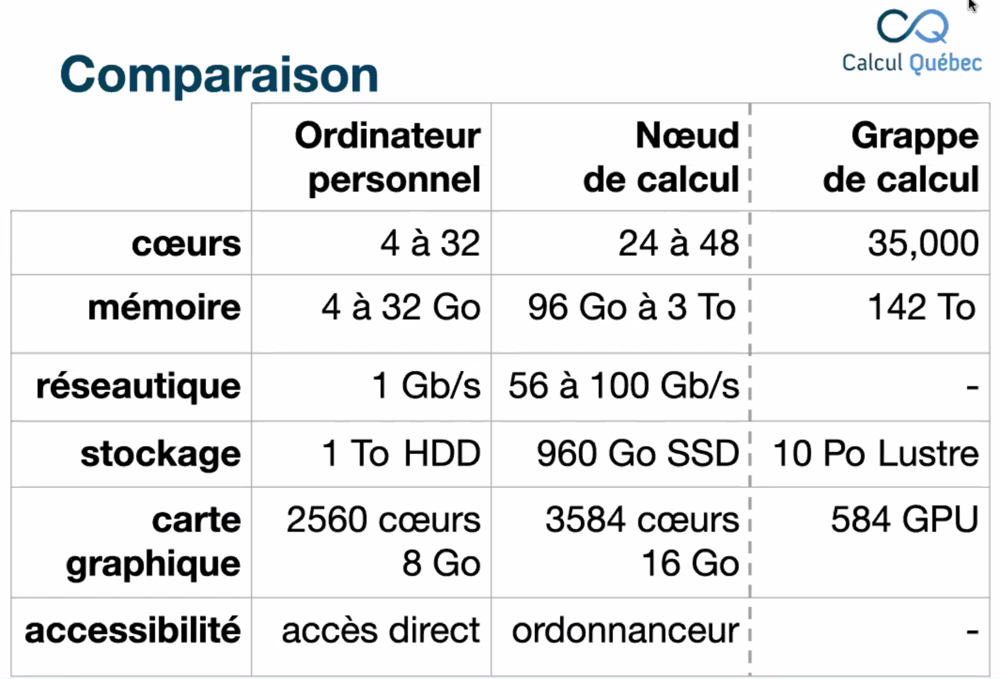
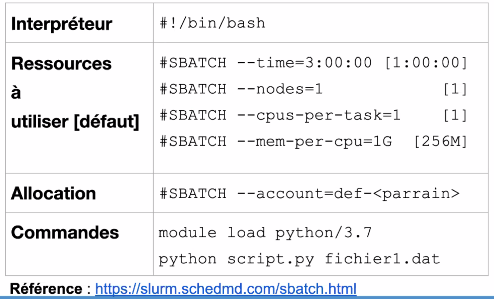
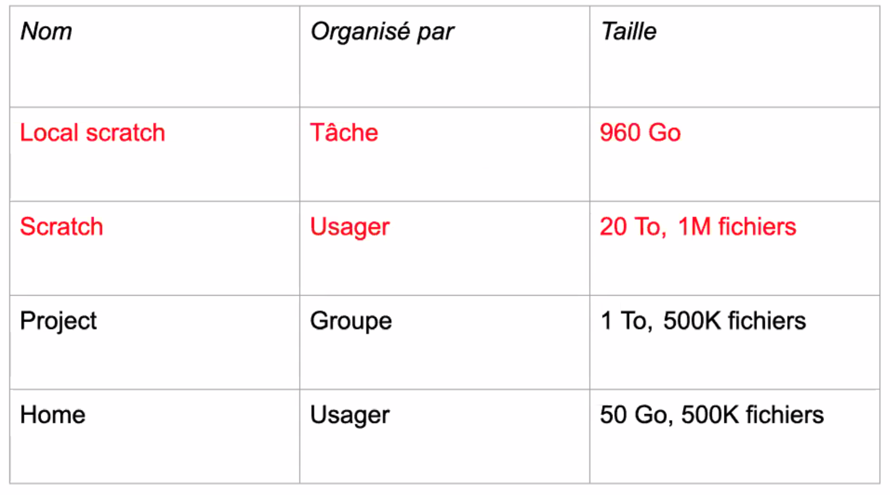

# Premiers pas sur les grappes de calcul

25 janvier 2022

Daniel Stubbs, CalculQuebec

## Introduction

### Objectifs

- familiarisation avec le calcul informatique de pointe (CIP) et son vocabulaire
- comprendre quels types de problèmes le CIP peut nous aider à résoudre
- comprendre sommairement le fonctionnement d'une grappe de calcul à CalculQuebec

### Parcours - étapes

1. réaliser qu'on a besoin de Calcul Québec
2. créer un compte
3. accéder au compte
4. transférer, installer, configurer
5. exécuter une tâche
6. [rencontrer un problème]
7. récupérer des résultats

## Parcours de l'usager type

### Réaliser qu'on a besoin de Calcul Québec

#### À quoi ça sert? 

CIP = tout calcul qui fait une utilisation intensive de ressources informatiques, ou qui est limité par les ressources disponibles

Pas uniquement le calcul (processus), mais aussi la mémoire (TB de mémoire vive etc.), stockage des données, carte graphique, temps (durée du calcul)

#### Exemples

1. Problèmes complexes
   - assemblage de génomes
   - dynamique des fluides
   - pipeline bio-informatique
   - simulation climatique
2. Données massives
   - apprentissage machine
   - marchés financiers
   - traitement d'images

### Créer un compte

Calcul canada + calcul québec : aide aux chercheur·se·s dans les provinces

- west grid (Fraser U, arbutus, cedar)
- compute Ontario (Toronto: Niagara et Warterloo: graham)
- calcul québec. Narval (Montréal), Beluga (ETS, en déménagement actuellement, retour prévu fin mars 2022)
- Acenet (est)

Favoriser une accélération de l'innovation scientifique en déployant des systèmes de calcul informatique de pointe, des installations de stockage et des solutions logicielles. 

Achète certaines licences mais choix de solutions libres. 

Offrir un accès gratuit aux supercalculateurs à travers le Canada, pour la recherche académique. Accès international pour les collaborateur·rice·s des chercheur·se·s canadien·ne·s.

Créer un compte: il faut être professeur dans une université canadienne. Après une confirmation du personnel de Calcul Canada, le·a prof peut parrainer ses étudiant·e·s et collaborateur·rice·s (CCRI: code alphanumérique qui est utilisé pour y référer pour les comptes parrainés)

https://ccdb.computecanada.ca/

Partage de compte est strictement interdit. Chaque être humain doit avoir son propre compte. Possibilité d'ajouter des rôles mais il faut toujours garder le même compte

renouvellement annuel du compte (confirmer les accès). Faire part des publications issues de l'utilisation des services de CalculCanada.

### Accéder au système

#### Quelle grappe choisir? 

- grappes nationales: niagara (conçu pour des grandes tâches parallèles, utilisation min de 1024 cœurs); accès général: cedar, graham, narval, béluga 
- celle que notre groupe utilise déjà 
- considérer la géographie pour minimiser un peu l'attente de connexion
- écrire à CC calcul informatique de pointe (CIP) 

#### Se connecter à la grappe

Accès par internet vers les grappes de calculs

[nomGrappe].computecanada.ca

connexion sur le nœud interactif (nœud frontal / de login) = accès direct, porte d'entrée vers une grappe = partagé

nœuds de calcul = accès indirect, 

à part cedar, on n'a pas accès à internet à partir des nœuds de calculs calcul informatique de pointe (CIP) 

Connexion à la grappe: 

- mac / linux = terminal `ssh [username]@[nomGrappe].computecanada.ca`
- windows = mobaXterm (gratuit) ou wsl (windows subsystem for linux)

[Documentation CC](https://docs.computecanada.ca/wiki/Compute_Canada_Documentation/fr)

```bash
ssh [username]@[nomGrappe].computecanada.ca
ssh username #dans l'exemple créé pour le tuto. username = login1
exit #quitter la grappe

```



Cœurs: narval --> 64 cœurs par nœud de calcul

stockage: espace de stockage sur le nœud + espaces scratch et espace projet (1TB par défaut, peut être augmenté jusqu'à 10, puis allocations spéciales pour certains groupes)

délais (accès) peut être 5 secondes ou 10 jours

#### Composantes d'un nœud

format "boîte de pizza", 24-30 nœuds par rack


organisation de visites dans les salles de machines (plus complexe avec la covid, leur écrire): très bruyant, très froid et très chaud, obligation utilisation d'eau froide et ventilateurspour refroidir les nœuds

rack de stockage, essentiellement composés de disques durs


Ordonnanceur: organise les tâches, optimiser l'utilisation des ressources, choisit le lancement de nos tâches sur un ou plusieurs nœuds. *On soumet une tâche à l'ordonnanceur et c'est lui qui lance la tâche sur les nœuds de calculs*

Stockage: trois grands espaces (home, projet, scratch)

Ethernet: pour les sys-admin

Infiniband: réseau puissant et cher

### Transférer, installer, configurer

une fois connecté·e·s, on est dans un environnement `Bash`

éditeurs de textes disponibles: nano, vim, emacs

#### Outils de transfert

`scp` (secure copy) ou `sftp`

```bash
scp [file] [username]@grappe:dir/file
```

outils graphiques: 

- WinSCP
- FileZilla

**Globus** 

outil graphique pour le transfert de grandes quantités de données sur une grande distance (Documenté sur le wiki)

Globus personnal connect: transfert de notre poste de travail vers la grappe etc.

~~FTP, BBCP, OwnCloud, Dropbox, etc~~

#### Exercice 1

```bash
nano testLena #create testLena file in login1
exit # leave login1
scp login1:testLena . #scp from login1 to current
#prints filename + infos connexion
cat testLena #view content to confirm scp
```

#### Charger des logiciels

- la plupart des logiciels dont on pourrait avoir besoin sont déjà installés sur la grappe, disponibles sous la forme de modules
- les modules permettent d'avoir plusieurs versions d'un même logiciel qui cohabitent, et de gérer les dépendances et les conflits

```bash
module #commande pour interagir avec les applications sur les grappes de calcul
module spider <module> #recherche
module avail [module] #disponible
module list #afficher
module load <module> #charge. exemple module load r/4.1.2
module unload <module> #décharge
module swap module1 module2 #changer de version
```

#### Exercice 2

Quels sont les modules chargés par défaut dans notre environnement? `module list`

Combien de version de R et quelle est la plus récente? `module spider r`

utilisation de R ? `R`(entrer, prend parfois du temps à charger)

#### Installation de logiciels

list des logiciels disponibles dans le wiki, probabilité que les logiciels connus sont déjà installés

- possibilité d'écrire un couriel pour demander l'installation d'une nouvelle version d'un logiciel et le rendre disponible comme module
- droit d'installer des logiciels dans notre répertoire personnel
- modules habituellement écrits dans des langages de programmation compilés (fortran, C, C++, java)
- dans le cas de logiciels en Python, R ou Perl: c'est notre obligation de les installer nous-même, car les dépendances de ces logiciels changent trop souvent, trop compliqué pour une gestion globale

configurations pour les analyses/calculs pour notre recherche

### Exécuter une tâches

Ordonnanceur: gère

- l'horaire des tâches
- la priorité des tâches
- l'accès aux ressources

Les tâches sont exécutées de manière différée, en fonction de la disponibilité des ressources = elle doivent donc être **autonomes** (mode "batch") 

#### Politique d'ordonnancement

privilégier les accès selon les modalités définies par le comité d'allocation des ressources (comité de pairs qui évalue les demandes d'allocations spéciales)

> Plus vous calculez, plus votre priorité diminue, moins vous calculez, plus elle augmente

#### Limites de ressources

Tous les serveurs ont des limites de ressources


durée maximale au Québec: 7 jours

si tâche très longue, risque d'être en attente longtemps

#### Tâches séquentielles

utilisent un seul cœur d'un seul nœud

ne bénéficient **pas** de demander davantage de ressources

#### Tâches parallèles

utilisent plusieurs cœurs ou nœuds à la fois

lire la documentation des logiciels pour savoir si le logiciel est fait pour s'exécuter en parallèle

<!-- vérifier pour les logiciels prévus pour l'Ouvroir-->

#### Parallélisme des données

1 même tâche sur plusieurs jeux de données. Même si le logiciel est séquentiel, les tâches s'effectuent de façon indépendantes. Parallélisme ne vient pas du logiciel mais des tâches à traiter.

- compter les occurrences d'un mot dans des miliers de documents
- filtre sur chaque pixel d'une image

Algorithme découpé en plusieurs tâches: les sous-tâches peuvent travailler sur les mêmes données (ou pas) et communiquent entre elles pour se synchroniser et échanger des données

Implique une quantité significative de communication entre les différentes tâches à réaliser (plus il y a de communication, plus ça ralentit le travail = coût indirect de la communication entre les processus)

scalabilité <!-- métaphore du nombre de personnes qui contribuent à la préparation d'un repas dans une cuisine-->

#### Fichier de soumission

fichier txt (typiquement 10-15 lignes)

Pour connaître la quantité de ressources, il faut faire des tests préalablement à la soumission de la tâche principale

Les scripts peuvent utiliser les programmes installés localement, tant que le chemin absolu est donné vers l'exécutable

- nombre de nœuds --nodes
- nombre de cœurs --cpus-per-task
- mémoire --mem-per-cpu
- allocation: def- <nomDuParrain->
- commandes shell



possibilité de soumettre plusieurs tâches, il y a une limite (~1000 en exécution/en attente)

#### Commandes utiles

```bash
sbatch <script.sh> #soumettre. retourne: jobid
squeue [-u $USER] #afficher la file d'attente
scancel <jobid> #annuler la tâche
sacct [-j <jobid] #affiche de la consommation des ressource par soi
```

#### Exercice 3

écrire un script de soumission de tâche:

- 1 seul cœur
- 256 Mo de mémoire = 1G
- 5 minutes
- charger modules
  - gcc/9.3.0
  - python/3.7.9
- exécuter la commande: `python --version`

```bash
#!/bin/bash
#SBATCH --time=0:05:00
#SBATCH --nodes=1
#SBATCH --cpus-per-task=1
#SBTACH --mem-per-cpu=1G
#SBATCH --account=def-sponsor00
module load gcc/9.3.0
module load python/3.7.9
python --version
```

```bash
seff <jobid>Pourriez-vous réexpliquer où se trouve le document de sortie? 
```

Où se trouve la sortie de cette tâche? 

`slurm-jobid.out`, se trouvera dans le dossier local de soumission. 

### Rencontrer un problème

1. les fichiers de sorties contiennent beaucoup d'éléments pertinents (informations, avertissements, erreurs, etc.)
2. faire vérifier par un pair
3. écrire à support@computecanada.ca

### Récupérer les résultatus

`scp`ou *globus*

#### Stockage

Sur les grappes, il y une hiérarchie des espaces de stockage. Chaque espace a ses avantages et inconvénients



espace projet: idéal pour partager avec les collègues dans le même groupe de recherche

home & projet: dans le système de sauvegarde, possibilité de restaurer les fichiers en écrivant au support.

local scratch & scratch: plus performant, mais pas de sauvegarde. 

scratch: fichiers plus vieux que 60 jours sont supprimés. Considéré comme un espace temporaire, une fois le travail terminé, il faut le déplacer dans projet par exemple

local scratch: très performant, accès uniquement dans une tâche. pas de quota sur le nombre de fichiers.

home, project, scratch: accès par login. tar ou zip pour les grands nombres de fichiers

Notes: 

- l'espace projet étant organisé par groupes, il est idéal pour le partage de données
- home, projet et scratch = espace partagé. faire attention de ne pas overload / bien organiser ses fichiers p
- home est l'espace par défaut mais très petit et mauvaise performance

voir état de son usage 

```bash
diskusage_report
```

#### Partage de données

- utiliser les permissions pur contrôle l'accès aux répertoires et aux fichiers
- plusieurs méthodes pour partager les données entre individus et groupes
- on peut même partager à des personnes qui n'ont pas de compte CC avec Globus
- wiki: partage de données


